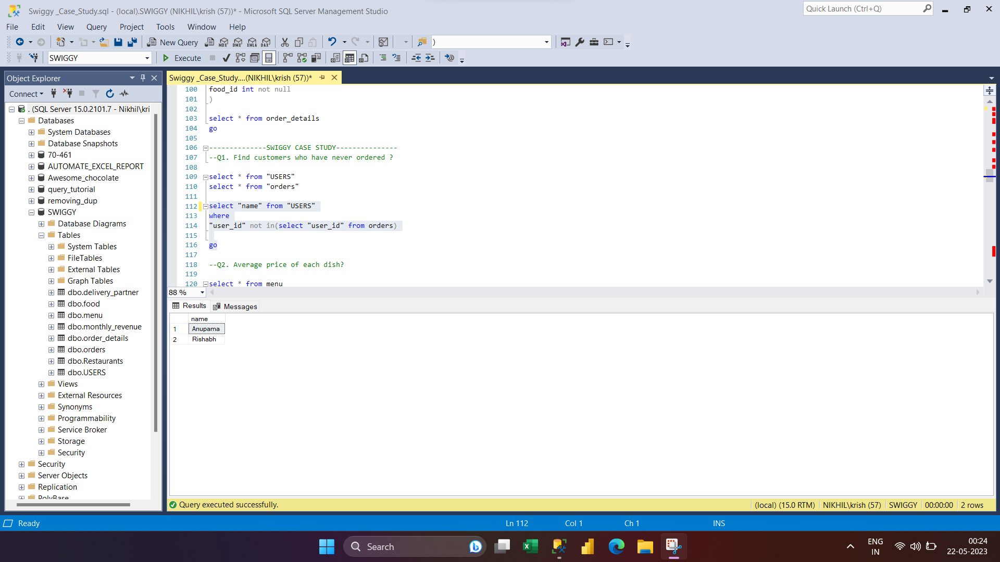
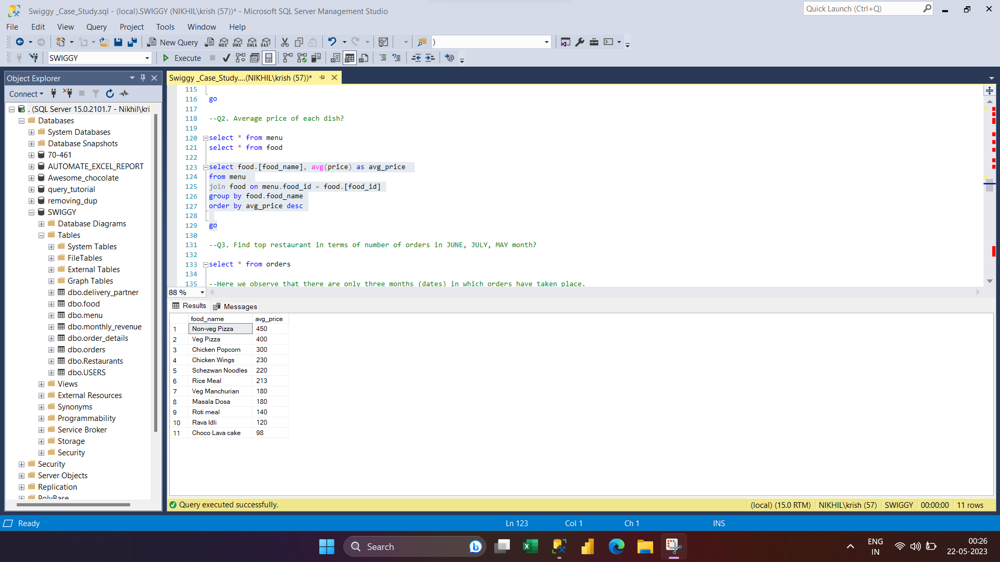
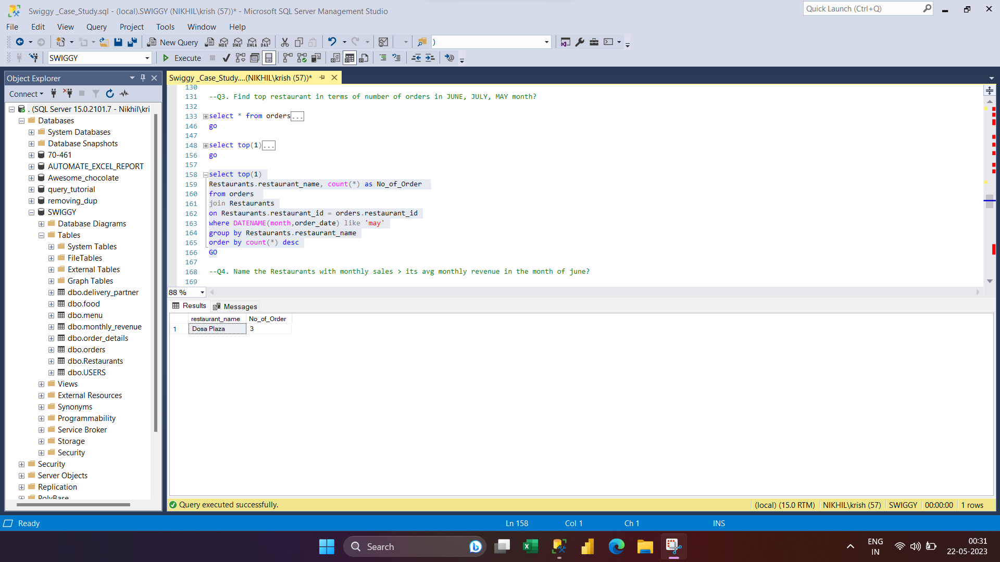
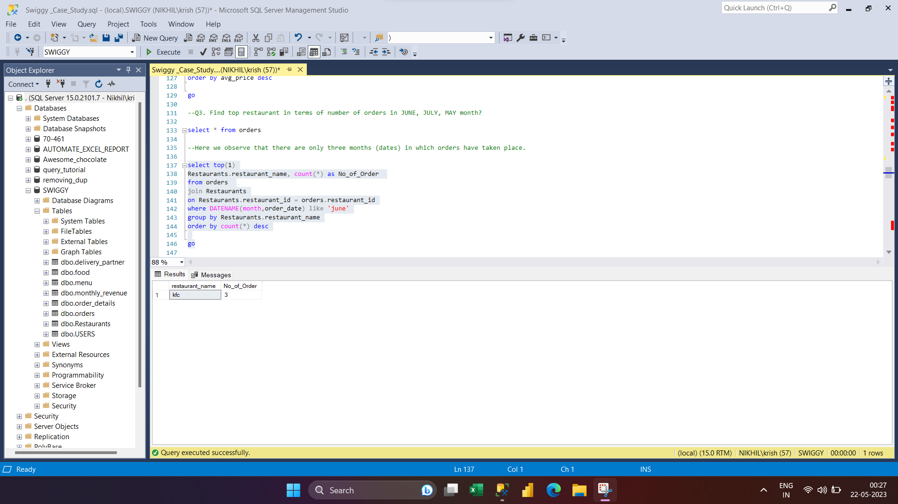
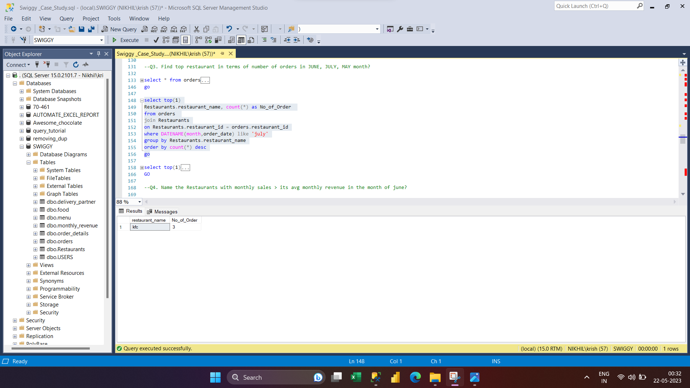
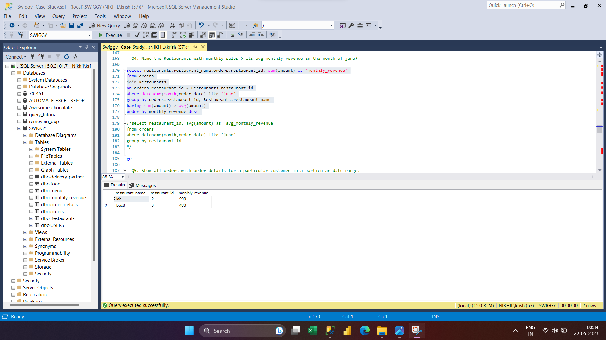
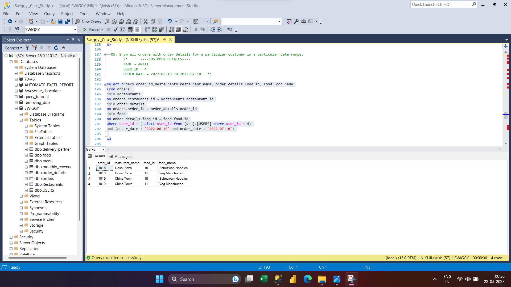
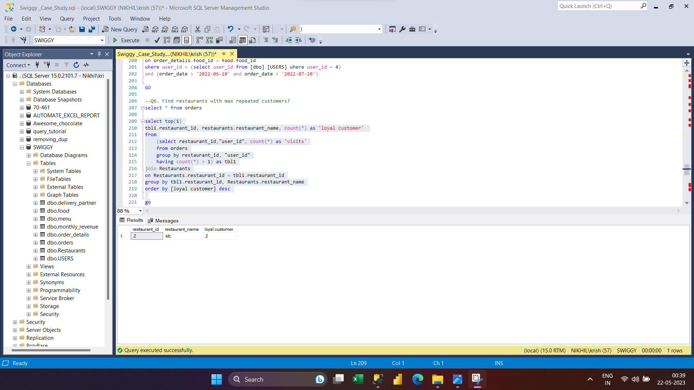
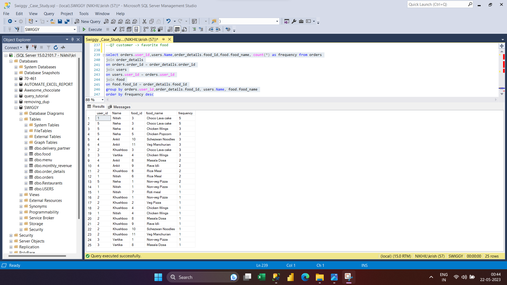

# CASE STUDY ON SWIGGY:
## Project Overview:
I successfully solved a complex case study on Swiggy using MS-SQL. My analysis provided insightful recommendations on operational strategies and growth opportunities, enabling the organization to maximize resources and capitalize on potential growth.
### Objectives:
###### •	Find customers who have never ordered?

###### •	Average Price/dish?

###### •	Find the top restaurant in terms of the number of orders for a given month?
###### MAY

###### JUNE

###### JULY

###### •  Name the restaurants with monthly sales > its avg monthly revenue in the month of june?

###### •	Show all orders with order details for a particular customer in a particular date range?

###### •	Find restaurants with max repeated customers

###### •	Customer - favorite food

